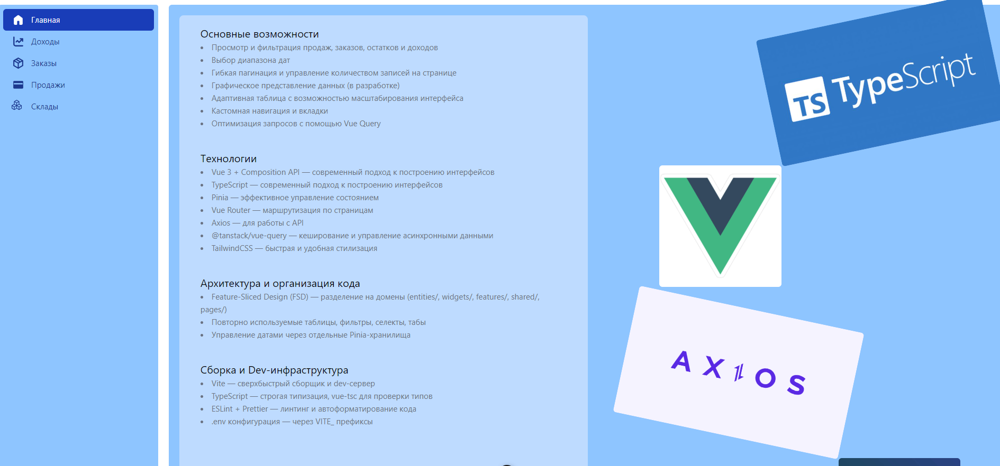

# 📊 Sales Dashboard (Vue 3 + TypeScript + FSD)

Современная админ-панель для анализа продаж, заказов и доходов.
Интерфейс построен на Vue 3 с использованием TypeScript, Pinia и TailwindCSS по архитектуре **Feature-Sliced Design (FSD)**.

---

## 🚀 Основные возможности

📅 Просмотр и фильтрация продаж, заказов, остатков и доходов
🗓️ Выбор диапазона дат и синхронизация фильтров
📈 Графическое представление данных (в разработке)
🧮 Гибкая пагинация и настройка количества записей
🧱 Адаптивная таблица с возможностью масштабирования интерфейса
🧭 Кастомная навигация и вкладки
⚡ Оптимизация запросов с помощью Vue Query

---

## 🚀 Технологии

---

## 📁 Структура проекта

src/
 ├─ app/           # Инициализация приложения
 ├─ pages/         # Страницы (Sales, Orders, Dashboard)
 ├─ widgets/       # Крупные блоки интерфейса (таблицы, фильтры, статистика)
 ├─ features/      # Фичи (фильтрация, пагинация, выбор даты)
 ├─ entities/      # Доменные модели (продажи, заказы, товары)
 ├─ shared/        # Общие компоненты, хуки, стили и утилиты

---

## 🧰 Команды

| Команда | Назначение |
|----------|------------|
| `npm run dev` | Запуск проекта в режиме разработки |
| `npm run build` | Сборка проекта |
| `npm run preview` | Предпросмотр собранного проекта |
| `npm run lint` | Проверка кода линтером |

---

## 🧠 Архитектура: Feature-Sliced Design

Проект структурирован по принципам **FSD**:
- 🧱 **App Layer** — инициализация приложения, провайдеры и маршруты  
- 📄 **Pages Layer** — композиции из виджетов и фич  
- 🧩 **Widgets Layer** — крупные блоки интерфейса (Sidebar, Header)  
- ⚙️ **Features Layer** — независимые фичи с бизнес-логикой  
- 🔖 **Entities Layer** — основные доменные сущности  
- ♻️ **Shared Layer** — переиспользуемый UI, утилиты, хуки  

---

## 🧩 Превью интерфейса

---

## ✨ Автор

**Лугинов Дьулустаан**  
Frontend Developer | React / TypeScript / Node.js  
📫 Telegram: [@JulustaanL](https://t.me/JulustaanL)

---